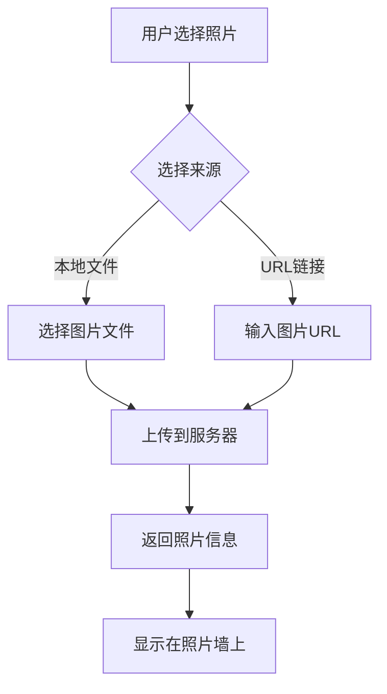
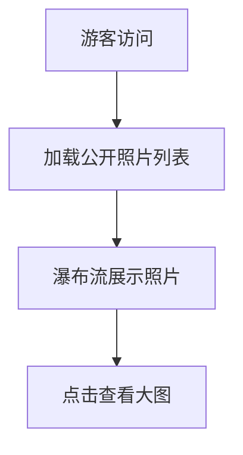

# 照片墙应用产品需求文档

## 1. 产品概述

一个现代化的照片墙应用，用户可以通过本地文件上传或URL链接两种方式添加照片。支持游客访问公开照片列表（MVP阶段仅实现核心功能）。

### 核心价值
- 简单易用的照片管理界面
- 支持多种照片来源（本地/URL）
- 游客可浏览公开照片墙

## 2. 核心功能

### 2.1 用户角色
| 角色 | 注册方式 | 核心权限 |
|------|---------|----------|
| 管理员 | 固定账户 | 上传/删除照片、管理公开列表 |
| 游客 | 无需登录 | 仅可浏览公开照片墙 |

### 2.2 功能模块
1. **首页/照片墙**：展示所有公开照片
2. **照片上传**：支持本地文件上传
3. **URL导入**：通过图片URL添加照片
4. **管理面板**：管理照片的公开/私密状态

### 2.3 页面详情
| 页面名称 | 模块名称 | 功能描述 |
|---------|---------|---------|
| 照片墙首页 | 照片展示区 | 瀑布流/网格布局展示所有公开照片 |
| 上传面板 | 文件上传 | 支持拖拽或点击上传本地图片文件 |
| URL导入 | 链接输入 | 输入图片URL添加到照片墙 |
| 管理控制台 | 照片管理 | 设置照片的公开/私密状态、删除照片 |

## 3. 核心流程

### 3.1 照片上传流程

### 3.2 游客浏览流程

## 4. 用户界面设计

### 4.1 设计风格
- **主题**：深色玻璃拟态风格（Glassmorphism），现代感强
- **配色方案**：
  - 主色：`#6366f1` (靛蓝色)
  - 次色：`#8b5cf6` (紫罗兰)
  - 强调色：`#f472b6` (粉红色)
  - 背景：`#0f0f23` (深蓝黑)
  - 文字：`#e2e8f0` (浅灰白)
- **按钮样式**：圆角按钮，悬停时带有柔和发光效果
- **字体**：
  - 标题：`Space Grotesk`（几何感强，现代）
  - 正文：`Inter`（清晰易读）
- **布局**：响应式网格布局，照片以瀑布流形式展示

### 4.2 页面设计

#### 照片墙首页
- **布局**：响应式网格，桌面端4-6列，平板3-4列，手机2列
- **照片卡片**：圆角、轻阴影、悬停放大效果
- **交互**：点击照片弹出灯箱查看大图
- **动画**：照片入场时淡入动画

#### 上传面板
- **文件上传区**：虚线边框拖拽区，支持点击选择
- **URL输入**：输入框 + 添加按钮
- **预览**：上传前显示缩略图预览

#### 管理控制台
- **照片列表**：表格或卡片形式展示所有照片
- **操作**：切换公开/私密状态、删除按钮
- **状态指示**：图标或标签显示照片状态

### 4.3 响应式设计
- **桌面端**：4-6列网格，完整侧边栏
- **平板端**：3-4列网格，精简导航
- **移动端**：2列网格，汉堡菜单

## 5. 技术约束

- **MVP优先**：仅实现核心功能，不做过度设计
- **性能优先**：图片懒加载，避免大量图片加载卡顿
- **兼容性**：现代浏览器（Chrome、Firefox、Safari、Edge最新版）
